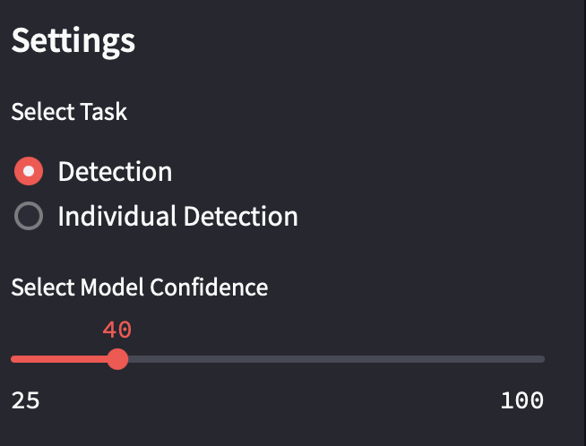
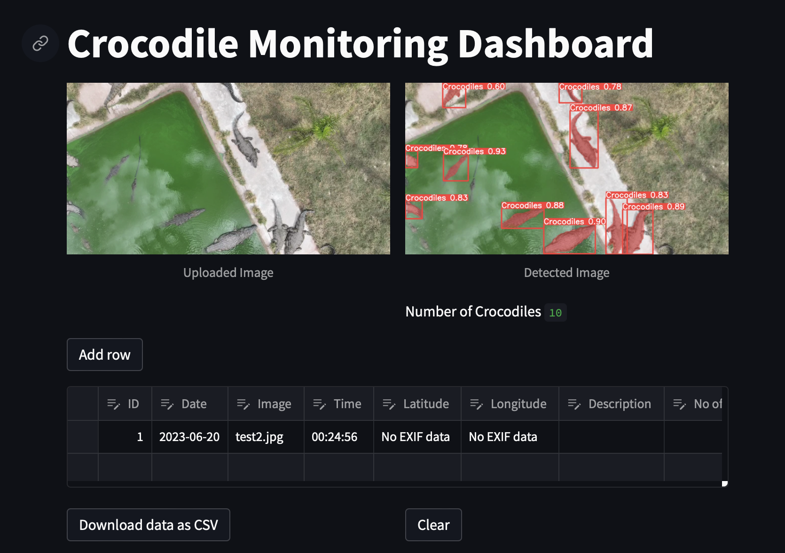
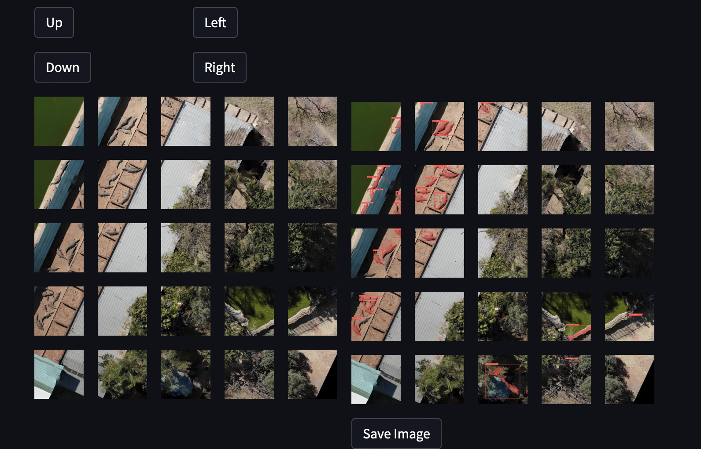
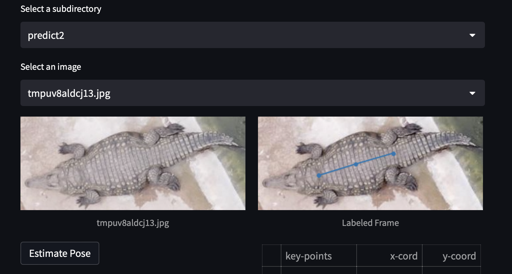

# Crocodile Detector Using YOLOv8 and SLEAP Framework

## Overview

This document provides a brief introduction to our crocodile detection model, which is built using the You Only Look Once version 8 (YOLOv8) architecture and the SLEAP (Social LEAP Estimates Animal Poses) framework. This system is designed to automatically detect and localize crocodiles in images, providing an efficient and reliable tool for wildlife conservation and research.

## Model Description

### YOLOv8

The model uses YOLOv8, an advanced real-time object detection system, to identify crocodiles in images. YOLOv8 is the latest version of the YOLO series and brings significant improvements in both performance and accuracy.

YOLOv8 processes images in a single pass, which makes it highly efficient and capable of real-time processing. It divides the input image into a grid, and each grid cell is responsible for detecting objects within its boundaries.

Each grid cell predicts multiple bounding boxes and class probabilities for those boxes. Bounding boxes are weighted by the predicted probabilities.

### SLEAP Framework

SLEAP is a deep learning framework designed for estimating animal poses. It is a multi-animal pose tracker that uses a top-down, bottom-up and single-animal approaches to estimate poses, meaning it first detects body parts and then assembles them into complete poses. 

SLEAP uses a combination of deep neural networks for the task: a centroid detector network to identify instances of animals and a part detector network to identify the body parts. The identified body parts and animal instances are then combined to generate the final pose estimation.

In the context of the crocodile detection model, SLEAP can be used to estimate and track the pose of detected crocodiles, which could provide additional insights such as behavior analysis, as well as possible animal identification.

## Usage

This model is expected to be used as a part of a wildlife monitoring or research system, providing insights into the presence and behavior of crocodiles in a given area. Possible applications include wildlife conservation, biodiversity studies, and behavior analysis.

## Limitations and Considerations

While YOLOv8 and SLEAP are highly powerful and versatile tools, there are a few considerations to keep in mind:

1. The accuracy of the model highly depends on the quality of the training data. The model must be trained with diverse and representative images of crocodiles for it to accurately detect them in different scenarios.

2. YOLOv8 can sometimes struggle with small objects or objects that are close together. Therefore, images with multiple crocodiles in close proximity might pose a challenge.

3. SLEAP's pose estimation capability assumes a certain level of visibility of the animal's body parts. If the crocodile is partially obscured or if the image quality is poor, accurate pose estimation might be challenging.

4. This model does not inherently include an ability to differentiate between individual crocodiles. For this functionality, additional steps are taken to compare the ratios of crocodile limbs to that of a database, such a database still needs to be built.

## Future Enhancements

1. Incorporating a mechanism to differentiate between individual crocodiles can significantly enhance the system’s utility, especially for long-term behavior and population studies, to achieve this, more specimens are required to build a database as well as further train the model.

2. Integrating this model with other sensors or data sources (e.g., thermal imaging, and environmental data) could provide richer context and improve detection performance.

3. Training the model on additional classes (e.g., other animals) could be valuable for more comprehensive monitoring of the environment.

## Installation

1. To install on a Windows device clone this repo to you local computer.
2. Ensure that python version 3.9 is installed on your system.
3. Run the **start_app.bat** file, this fill will install all the required dependencies if they are not installed already, and then launch the dashboard.

## Dashboard Usage

1. Upload an image in any of the following formats: jpg, jpeg, png, bmp, webp,tif.
2. Once an image is uploaded, begin with the "detection" task. Set the detection confidence using the slider, default is 60%.
   

3. Inference is done automatically once an image is uploaded, crocodiles are detected, and the number thereof displayed.
 
4. Clicking "Add row" will pull metadata from the uploaded image and add it to the editable table.
5. User can remove the image, and do inference on additional images, and compile the table. Once complete, the table can be downloaded as a csv file for further analysis.
6. .tif files are large and handled differently. The file is split into several smaller images, but only a subsection is displayed on the dashboard.
 
7. Using the control buttons, the user can move across the large tif file. On the left-hand side is the original file, and on the right-hand side are the images with detected crocodiles.
8. Pressing the **save Image** button will save the full image file as a .jpg and a .tif to the following directory: ~/lib/Output/
9. Switching to the experimental **Individual Detection** task. The user can select from the list of crocodiles detected  obtained from the earlier detection task from the drop-down list. 
10. The **Estimate Pose** button will run a pose estimation on the image, and the results are tabulated.

